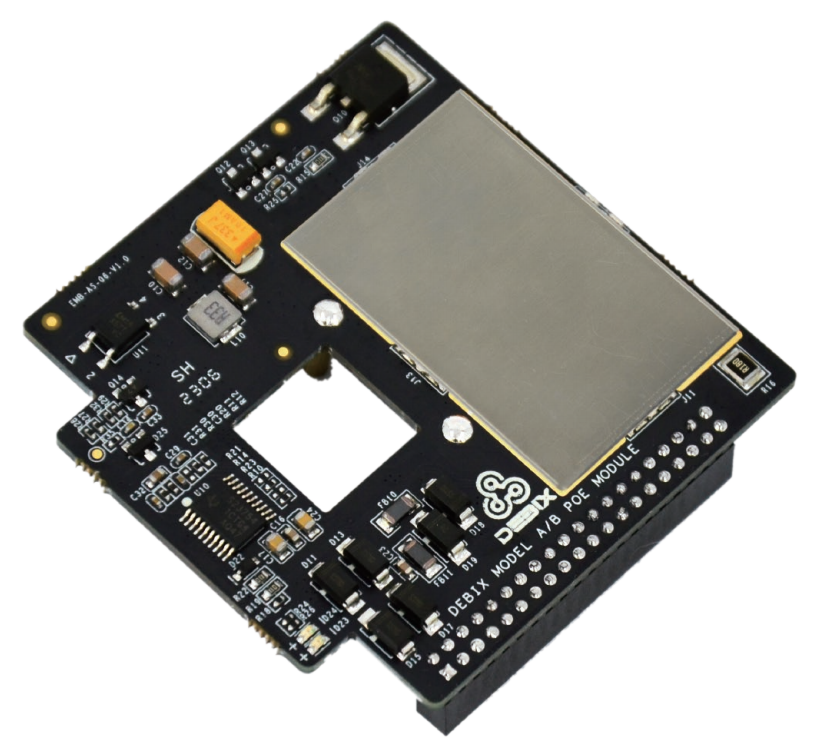
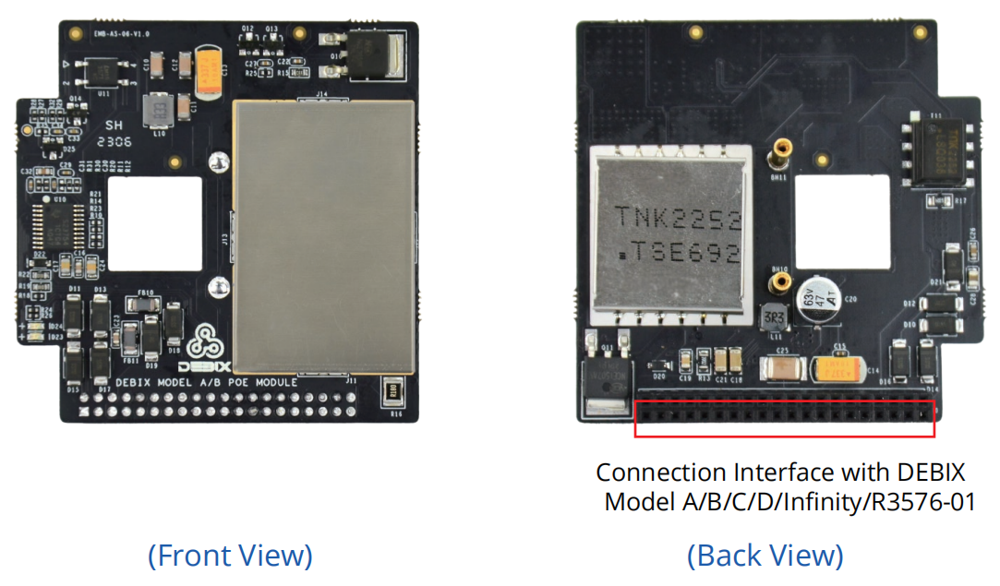
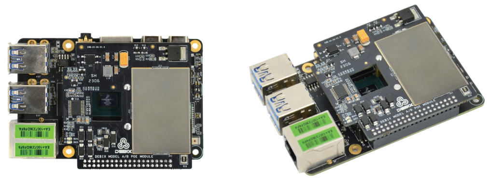

# DEBIX SBC PoE Module
 

## Overview
DEBIX SBC PoE Module is compatible with DEBIX Model A, DEBIX Model B, DEBIX Model C, DEBIX Model D, DEBIX Infinity SBC and DEBIX R3576-01, which have a RJ45 Gigabit Ethernet port supporting PoE function. It provides stable DC power for your DEBIX SBC and reduces the cost of constructing network infrastructure.

## Compatibility:
- Compatible with DEBIX Model A, DEBIX Model B, DEBIX Model C, DEBIX Model D, DEBIX Infinity, and DEBIX R3576-01
- Can be installed with DEBIX Model A/B/C/D/Infinity/R3576-01 in the EMC-7090B series enclosure

## Specification
| Specification   |                              |
|-----------------|------------------------------|
| LED             | 1 x PoE Power Input LED, 1 x 5V Power Output LED   |
| Support Protocol| IEEE 802.3at-2009 PoE        |
| Power Input     | DC 50V-57V, Class 4 device   |
| Power Output    | DC 5V/4A                     |
| Dimension       | 57.0mm(L) x 51.3mm(W) x 1.6mm(H) The highest component of the TOP layer and the BOT layer are 4mm and 10mm respectively.         |
| Operating Temp. | -40°C~85°C                   |
| N et Weight     | 33g (±0.5g)                  |

## Connection with DEBIX Model A/B:

## Safety Instructions and Warnings:
**General:**
- Avoid exposure to water, moisture and conductive surfaces while operating.
- Handle with care to avoid mechanical or electrical damage to the circuit board and connectors.
- Only handle the board by the edges when powered on to minimize the risk of electrostatic discharge damage.

**Environment:**
- Operate in a well-ventilated environment, even if using a case.
- Place on a stable, flat, non-conductive surface and avoid contact with conductive items.

**Connections:**
- Use peripherals that comply with relevant standards for the country of use and ensure proper insulation and operation.

**Additional notes:**
- This summary is not exhaustive, please refer to the full User Manual for details.
- If you are unsure about any aspect of safety or operation, consult a qualified
professional.

## Contact Us
- **Headquarters**: DEBIX Technology Inc., 8345 Gold River Ct., Las Vegas, NV 89113, USA  
- **Factory**: 5-6/F., East Zone, Shunheda A2 Building, Liqxiandong Industrial Park, XiLi, Nanshan Dist., Shenzhen, China  
- **Email**: info@debix.io  
- **Website**: [www.debix.io](https://www.debix.io)  
- **Community**: [Discord](https://discord.com/invite/adaHHaDkH2)